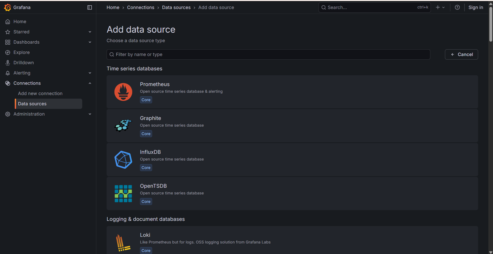
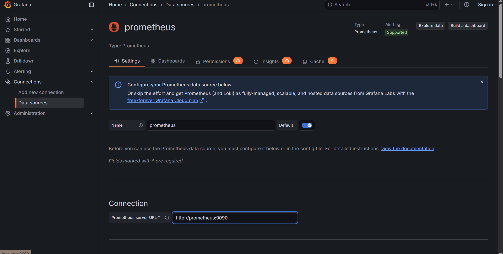
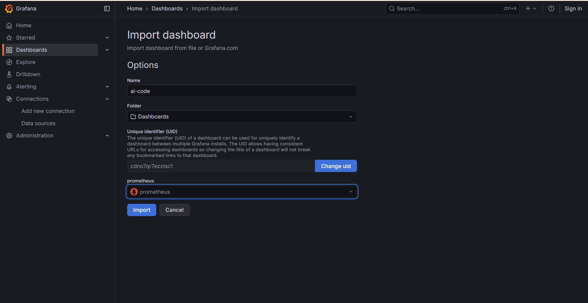
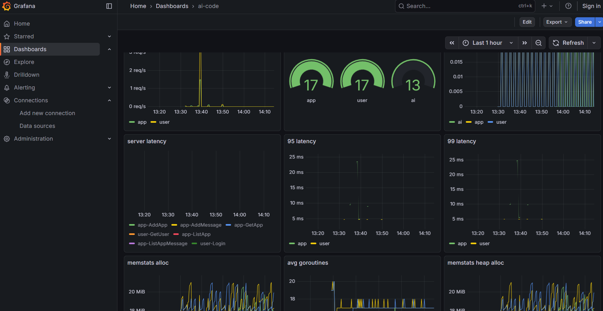

# 可观测性&&运维
> 基于**prometheus**和**grafana**进行运维

## 快速开始

如果已经使用**Docker**部署了**ai-code**访问地址为
[http://<your_ip>:3000](http://<your_ip>:3000)

首先我们启动一个**prometheus**数据库

选择**prometheus**

然后在数据库url一栏填写**http://prometheus:9090**

**save**即可

然后在**Dashboard**中,**new**选项选择**import**

在我的项目目录下有**deploy/grafana.json**,直接复制粘贴导入

然后选择想要的名字，数据库选择**prometheus**，目录可自行选择

然后就可以根据控制面板来检测程序运行情况了

